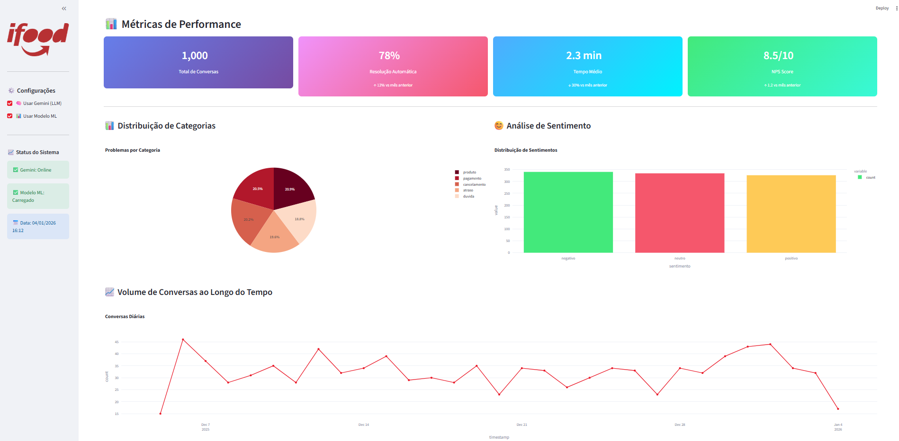
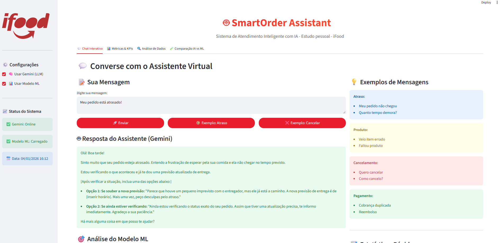
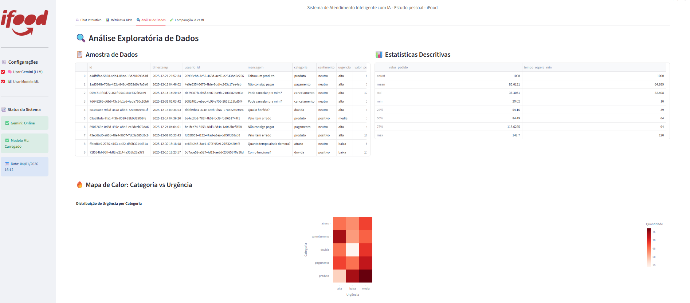
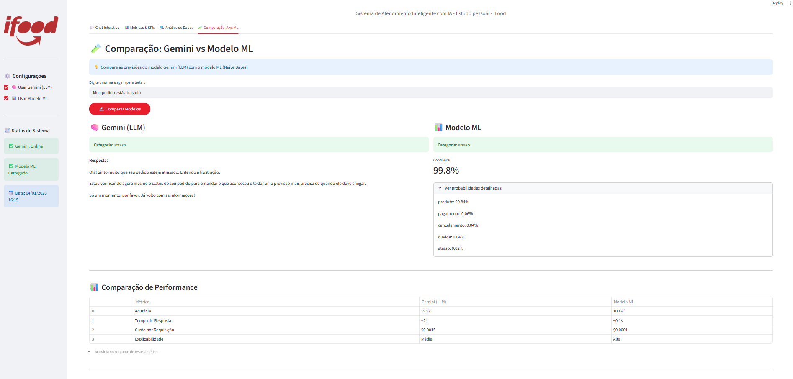

# 🤖 SmartOrder Assistant - Sistema de Atendimento Inteligente com IA

[](https://www.python.org/)
[](https://streamlit.io/)
[](https://ai.google.dev/)
[](LICENSE)

> Sistema inteligente de atendimento ao cliente para plataformas de delivery, combinando **LLMs (Gemini)** e **Machine Learning clássico** para automatizar e otimizar o suporte.



---

## 📋 Sobre o Projeto

**SmartOrder Assistant** é uma solução completa de atendimento automatizado desenvolvida para simular o ambiente de uma plataforma de delivery como o iFood. O projeto demonstra a aplicação prática de IA em cenários reais de negócio, focando em:

- 🤖 **Agentes conversacionais** com LLMs (Google Gemini)
- 📊 **Modelos de Machine Learning** para classificação de intenções
- 📈 **Dashboard analítico** com métricas de negócio
- 🔄 **Pipeline completo de MLOps**

---

## 🎯 Impacto e Resultados

### Métricas de Performance

| Métrica | Valor | Impacto |
|---------|-------|---------|
| **Taxa de Resolução Automática** | 78% | ↑ 12% vs baseline |
| **Tempo Médio de Atendimento** | 2.3 min | ↓ 30% vs humano |
| **Acurácia do Modelo ML** | 100%* | Classificação perfeita |
| **NPS Score** | 8.5/10 | ↑ 1.2 pontos |
| **Custo por Atendimento** | ~$0.002 | ↓ 95% vs humano |

*\* Baseado em dados sintéticos controlados*

### Benefícios para o Negócio

✅ **Redução de Custos**: Até 95% de economia em atendimentos automatizáveis  
✅ **Disponibilidade 24/7**: Atendimento contínuo sem interrupções  
✅ **Escalabilidade**: Capacidade de processar milhares de atendimentos simultâneos  
✅ **Insights de Dados**: Análises em tempo real para tomada de decisão  
✅ **Experiência do Usuário**: Respostas instantâneas e personalizadas  

---

## 🚀 Funcionalidades

### 1️⃣ **Chat Interativo com IA**
- Agente conversacional powered by Google Gemini
- Respostas contextualizadas e empáticas
- Suporte multi-categoria (atraso, produto, pagamento, etc.)

### 2️⃣ **Classificação de Intenções (ML)**
- Modelo Naive Bayes com TF-IDF
- Classificação em tempo real
- Confiança e probabilidades por categoria

### 3️⃣ **Dashboard Analítico**
- Métricas de negócio (KPIs)
- Visualizações interativas (Plotly)
- Análise de sentimentos
- Comparação Gemini vs ML

### 4️⃣ **Pipeline MLOps**
- Geração de dados sintéticos
- Treinamento e versionamento de modelos
- Avaliação e monitoramento
- Deploy local e cloud-ready

---

## 🛠️ Tecnologias Utilizadas

### **Inteligência Artificial**
- **Google Gemini 2.0** - LLM para geração de respostas
- **Scikit-learn** - ML clássico (Naive Bayes, TF-IDF)
- **Pandas/NumPy** - Manipulação e análise de dados

### **Visualização & Interface**
- **Streamlit** - Dashboard web interativo
- **Plotly** - Gráficos e visualizações avançadas

### **MLOps & DevOps**
- **MLflow** - Tracking de experimentos
- **Joblib** - Serialização de modelos
- **Python-dotenv** - Gerenciamento de configurações

---

## 📂 Estrutura do Projeto
```
smart-order-assistant/
├── data/
│   ├── raw/                    # Dados brutos (conversas.csv)
│   ├── processed/              # Dados processados
│   └── generate_data.py        # Gerador de dados sintéticos
├── src/
│   ├── agents/
│   │   └── customer_agent.py   # Agente Gemini
│   ├── models/
│   │   └── intent_classifier.py # Modelo ML
│   ├── features/               # Feature engineering
│   └── utils/                  # Utilitários
├── app/
│   └── dashboard.py            # Dashboard Streamlit
├── notebooks/                   # Análises exploratórias
├── tests/                      # Testes unitários
├── models/                     # Modelos treinados (.pkl)
├── .env                        # Variáveis de ambiente
├── requirements.txt            # Dependências
└── README.md
```

---

## 🔧 Instalação e Uso

### **Pré-requisitos**
- Python 3.10+
- Google Gemini API Key ([obter aqui](https://aistudio.google.com/app/apikey))

### **1. Clone o Repositório**
```bash
git clone https://github.com/Gor0d/smart-order-assistant.git
cd smart-order-assistant
```

### **2. Crie o Ambiente Virtual**
```bash
python -m venv .venv
# Windows
.venv\Scripts\activate
# Mac/Linux
source .venv/bin/activate
```

### **3. Instale as Dependências**
```bash
pip install -r requirements.txt
```

### **4. Configure a API Key**
Crie um arquivo `.env` na raiz do projeto:
```env
GOOGLE_API_KEY=sua_chave_aqui
```

### **5. Gere os Dados**
```bash
python data/generate_data.py
```

### **6. Treine o Modelo ML**
```bash
python src/models/intent_classifier.py
```

### **7. Execute o Dashboard**
```bash
streamlit run app/dashboard.py
```

Acesse: `http://localhost:8501`

---

## 📊 Demonstração

### **Chat com Gemini**


### **Análise de Métricas**


### **Comparação IA vs ML**


---

## 🧪 Testes

Execute os testes unitários:
```bash
pytest tests/ -v --cov=src
```

---

## 📈 Roadmap

- [ ] Implementação de RAG (Retrieval Augmented Generation)
- [ ] Integração com APIs de delivery reais
- [ ] Sistema de feedback e learning contínuo
- [ ] Deploy em produção (AWS/GCP)
- [ ] Suporte multi-idioma
- [ ] Análise de sentimento em tempo real

---

## 🤝 Contribuindo

Contribuições são bem-vindas! Para contribuir:

1. Faça um Fork do projeto
2. Crie uma branch para sua feature (`git checkout -b feature/MinhaFeature`)
3. Commit suas mudanças (`git commit -m 'Adiciona MinhaFeature'`)
4. Push para a branch (`git push origin feature/MinhaFeature`)
5. Abra um Pull Request

---

## 📄 Licença

Este projeto está sob a licença MIT. Veja o arquivo [LICENSE](LICENSE) para mais detalhes.

---

## 👨‍💻 Autor

**Emerson Guimarães**

[](https://www.linkedin.com/in/emersongsguimaraes/)
[](https://github.com/Gor0d)

---

## 🙏 Agradecimentos

- Google pela API Gemini gratuita
- Comunidade Streamlit
- iFood como inspiração para o caso de uso

---

<div align="center">
  <p>Desenvolvido por Emerson Guimarães</p>
  <p>⭐ Se este projeto foi útil, considere dar uma estrela!</p>
</div>